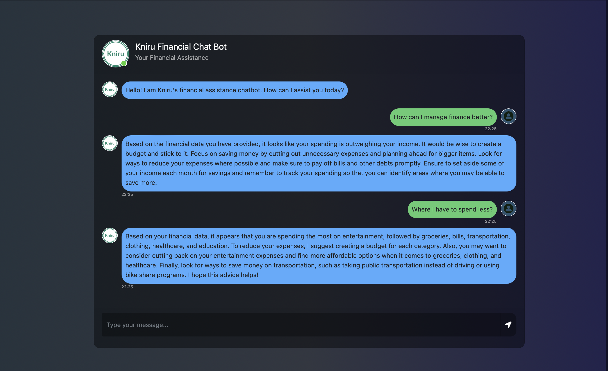

# Kniru_Financial-chat-bot
The "Kniru_Financial-chat-bot" is a Flask-based chatbot that assists users with their financial data and provides suggestions based on the given information. It utilizes the OpenAI API to generate responses for user queries. It is developed for Kniru Home-Exam.

[]

## Get Your API Key from openAI

```
https://platform.openai.com/account/api-keys
```
After copying your API key paste it into the app.py file on 6th line at the place of YOUR_API_KEY (OPENAI_API_KEY = 'YOUR_API_KEY') Inside the ('')
 
## Installation & Setup

[Install Python] 
```
https://www.dataquest.io/blog/installing-python-on-mac/
```
[Install pip] 
```
https://phoenixnap.com/kb/install-pip-mac
```
If you have Python & pip installed then check their version in the terminal or command line tools

```
python3 --version
```

```
pip --version
```

## Installing Flask and OpenAI

In your terminal run the requirements.txt file using this pip

```
pip install -r requirements.txt
```

## Now the final Part running the application 

Run this command in the terminal
```
python app.py

```


